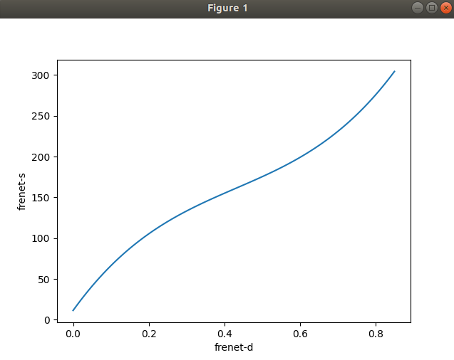

# Simple Path Planning in c++ game

* An Original developer's github: https://github.com/nguyenhopquang/CarRacing

## Final result

## Original game

## Procedure (2021 Jun ~ Jul)

### Kinematic Modeling

* Original game could move a car without considering kinematic model of a car.
* So I've modeled a car to rotate considering kinematic model.

### Waypoints

* I've used waypoints to plan the path.
* The car is modeled to follow the nearest waypoint.

### Path planning

* When waypoints are near enough to the obstacle car, path is changed linearly to the nearest lane where the obstacle car doesn't exist.

## Video (2021 Jun ~ Jul)

## Limitations 1
* The road is designed straight so there aren't many variables to be considered.
* I haven't considered longitudinal planning which is going to be next challenge for me.
* A planned path was linear, which is simple but bad in terms of acceleration user might feel and for avoiding obstacle.
* I didn't used Frenet frame. Since the road was straight, it was meaningless. But I'm 100% sure that I'll use it on my next path planning project. 

## What I've learned 1
* How to use SFML library
* Got more familiar with C++
* Basic concepts of path planning.
* How to deal with codes over 500 lines and with lots of functions.(Got used to handle the flow of long codes.)

## Procedure (2021 Sept~ Sept)

### Waypoints
* I have planned waypoints to have minimum acceleration.
* When planning waypoints I've used <U>**Frenet frame.**</U> and converted to cartesian when draw them on the simulation.

### Stanley method control
* Approximated targeted yaw by differentiate the waypoints curve.

  
## Limitations 2
* Still haven't planned the velocity of a car.
* I've planned only two paths, which isn't enough for real driving situation. I'm planning to plan much more paths and use custom cost function to choose which one to follow on my next update or project.
* For now, I couldn't plan path during avoiding obstacle which could be dangerous in real situation.

## What I've learned 2
* At first, it looked kind of easy for me to implement it but during implementation I've learned that it was much more complicated than I expected.
* How to convert Frenet frame to cartesian frame and vice versa.
* Implementing stanley control
* Detailed ways to implement path planning.

